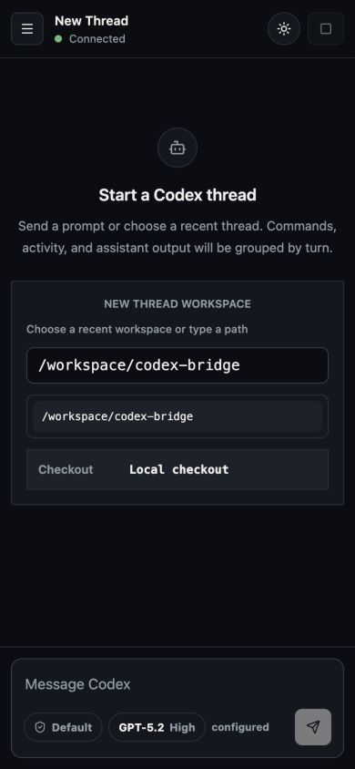
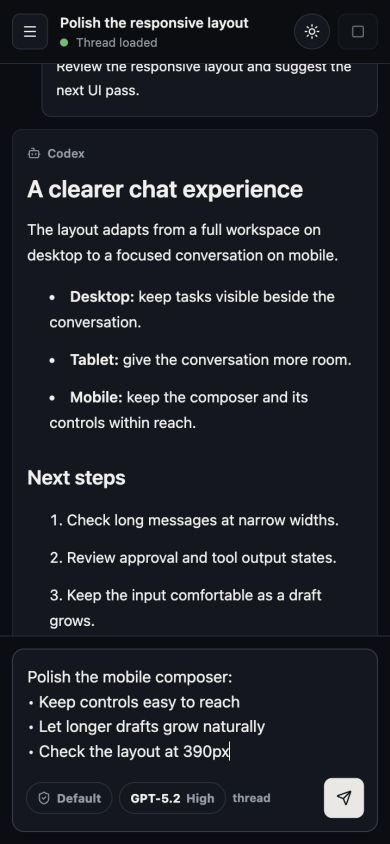
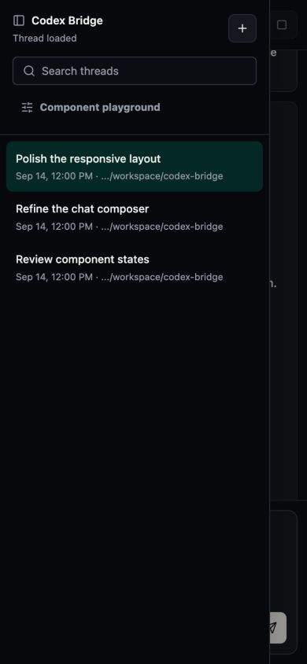

# Codex Bridge

**Obsolete experimental software. Insecure by design. Do not expose it to the public internet or use it as a security boundary.**

A local web interface for the Codex desktop app's `app-server`, with a React chat UI, a component playground, and macOS service scripts. This project is retained as a reference; it is not maintained as a supported integration.

## Mobile UI

Captured in the in-app Browser at 390 × 844 using synthetic sample data.

| New thread · empty composer | Conversation · multiline draft | Mobile thread navigation |
| --- | --- | --- |
|  |  |  |

## Security

The bridge has no authentication or WebSocket Origin validation. Connected clients can access conversations and send agent requests, including approval responses. The RPC method filter is not an authentication mechanism. Run only in an environment where everyone who can reach the service is trusted.

The service launcher may bind to a Tailscale address when available. Review the bind address and network access before running it. The launchd configuration, service scripts, and some playground examples contain paths from the original author's machine; adapt them before use.

Never commit credentials, private keys, environment files, logs, or local Codex session data. Common filenames are excluded by `.gitignore`, but ignore rules cannot detect secrets embedded in source files or remove secrets already committed. Any `.env.example` or `.env.sample` must contain placeholders only.

## Run locally

Requires macOS, an installed Codex desktop app, and a Node.js version compatible with Vite 8.

```sh
npm ci
HOST=127.0.0.1 npm run dev
```

Open <http://127.0.0.1:9011>. The component playground is at `/playground`.

For a production build:

```sh
npm run build
HOST=127.0.0.1 npm start
```

Configuration is read from environment variables, including `HOST`, `PORT`, `CODEX_BIN`, `CODEX_THREAD_CWD`, and `CODEX_BRIDGE_BASE_PATH`. The default Codex binary is `/Applications/Codex.app/Contents/Resources/codex`. Set `CODEX_THREAD_CWD` to the directory you want new tasks to use; otherwise it defaults to the parent of this project.

## Repository scope

This repository contains only the `codex-bridge` project, published with a fresh history. It does not include the surrounding workspace or its generated artifacts.
